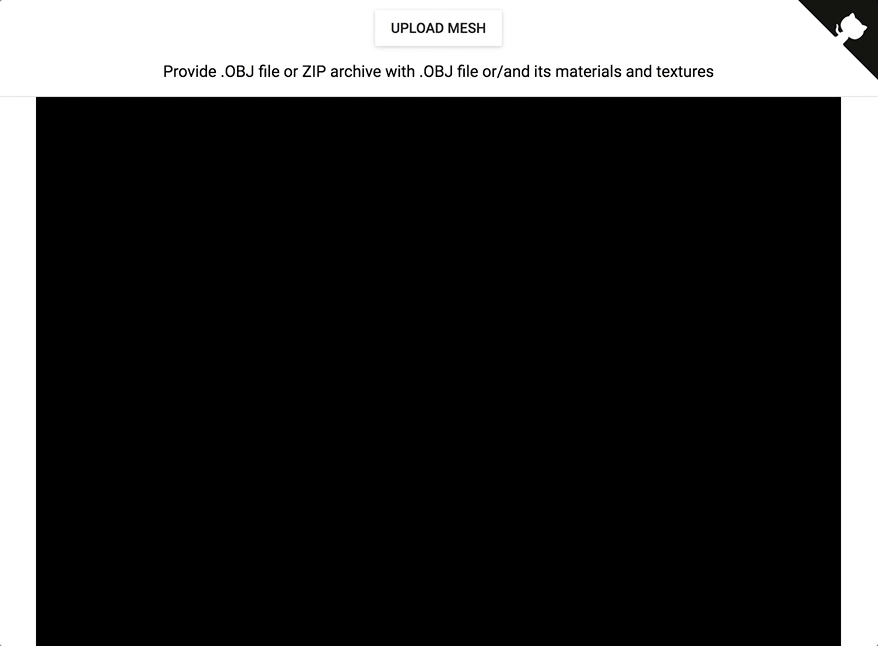
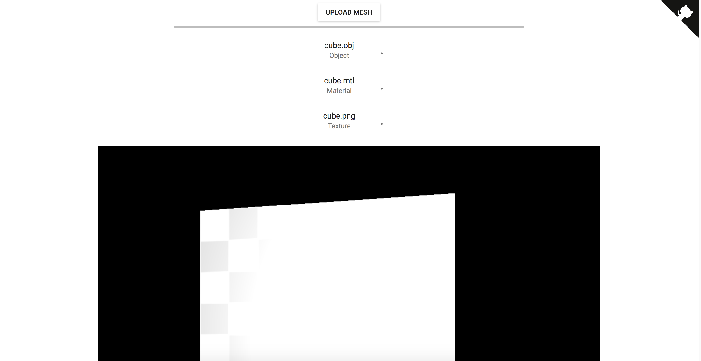

# 3D Viewer

Simple React and Three.js based 3D Viewer:

## TODO and Bugs:

- ~~Some OBJ files with texture cannot be opened~~ (they were out of view frustum)
- ~~Some OBJ files texture is not applied~~ (they were out of view frustum)
- ~~Make lightning dependant on the mesh bounding box size~~ (attached it to camera)
- Add 3D controls
- Clean up code

# Screenshots

